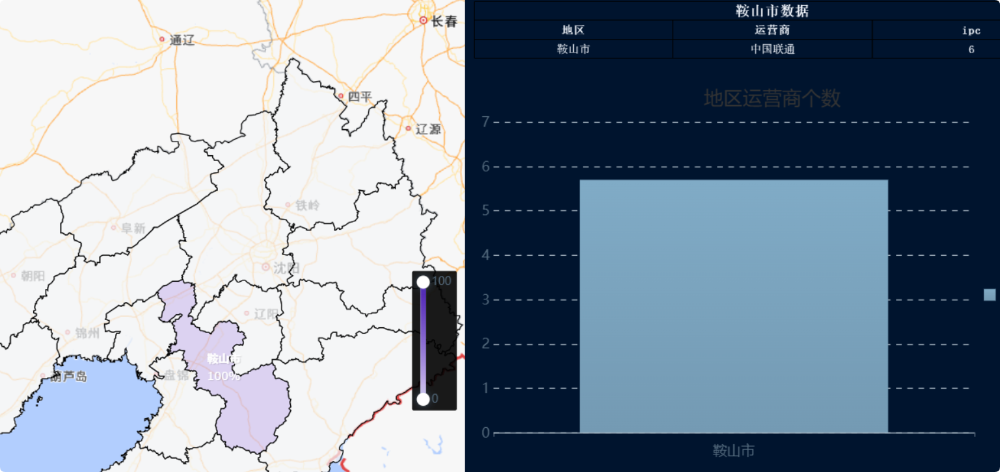
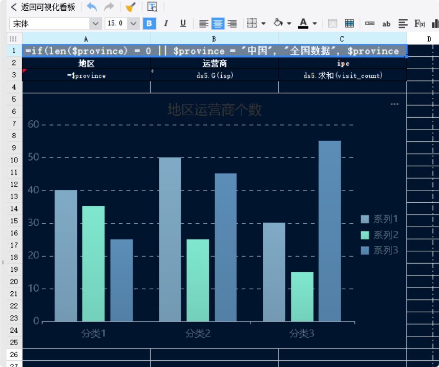

11月14日 韩天昊
# 地图下转

WITH

t1 AS (
SELECT
province,
city,
isp,
visit_count,
ROW_NUMBER() OVER (PARTITION BY province ORDER BY visit_count DESC) as pm
FROM heat_map_drilldown_stats
WHERE ds = '2025-11-01'
),

t2 AS (
SELECT *,
MAX(pm) OVER(PARTITION BY province) as max_rn
FROM t1
),

t3 AS (
SELECT *,
max_rn * 0.3 as rate_high,
max_rn * 0.4 + max_rn * 0.3 as rate_media
FROM t2
),

t4 AS (
SELECT *,
CASE
WHEN max_rn <= 2 THEN 'gray'
WHEN pm < rate_high THEN 'MistyRose'
WHEN pm < rate_media AND pm >= rate_high THEN 'Coral'
WHEN pm >= rate_media THEN 'DarkRed'
END as fr_region_color
FROM t3
)

SELECT
province,
city,
isp,
visit_count,
fr_region_color
FROM t4;

